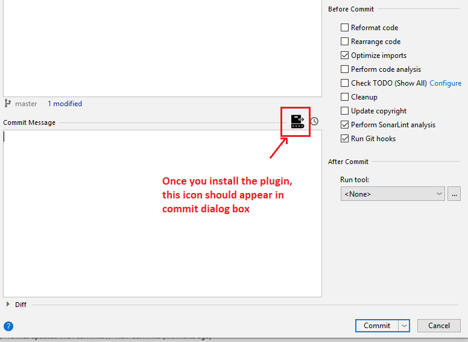

# git_custom_commit

<iframe frameborder="none" width="245px" height="48px" src="https://plugins.jetbrains.com/embeddable/install/14776"></iframe>

<!-- Plugin description -->
<h3>Automate and formalise your commit convention</h3>
<b>With this plugin you can:</b>
<ol>Draft custom git commit messages</ol>
<ol>Tag git messages as some type</ol>
<ol>Ensure that particular format is used as commit convention in your project</ol>
<!-- Plugin description end -->

## Installation

- Using IDE built-in plugin system:
  
  <kbd>Preferences</kbd> > <kbd>Plugins</kbd> > <kbd>Marketplace</kbd> > <kbd>Search for "git_custom_commit"</kbd> >
  <kbd>Install Plugin</kbd>
  
- Manually:

  Download the [latest release](https://github.com/shan-96/git_custom_commit/releases/latest) and install it manually using
  <kbd>Preferences</kbd> > <kbd>Plugins</kbd> > <kbd>⚙️</kbd> > <kbd>Install plugin from disk...</kbd>

## Usage

## Compatibility Notes
- The plugin is compatible with IntelliJ IDEA version 2019.1 and higher

---
Plugin based on the [IntelliJ Platform Plugin Template][template].

[template]: https://github.com/JetBrains/intellij-platform-plugin-template
This plugin is a modified version of [a repo here](https://github.com/MobileTribe/commit-template-idea-plugin)
